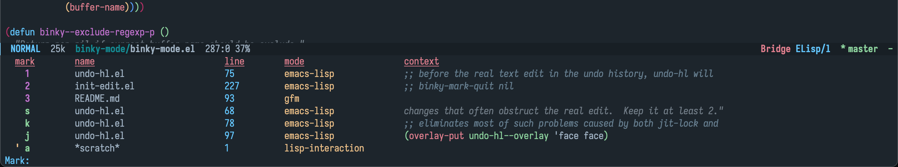

# binky-mode

[](LICENSE)
[](http://melpa.org/#/binky-mode)

Jump between points like a rabbit !

This package provides commands to jump between points in buffers and files.
Marked position, last jump position and recent buffers are all supported in
same mechanism like `point-to-register` but with an enhanced experience.

<!-- markdown-toc start -->

**Table of Contents**

- [binky-mode](#binky-mode)
  - [Screenshot](#screenshot)
  - [Install](#install)
    - [dependencies](#dependencies)
    - [package](#package)
  - [Usage](#usage)
  - [Customization](#customization)
  - [Feature](#feature)
  - [Comparison](#comparison)
  - [Todo](#todo)
  - [License](#license)

<!-- markdown-toc end -->

## Screenshot

- Call `M-x binky-*` related command



`?` for toggle preview mannually, `q` or `escape` for quit

- Call `M-x binky-margin-mdoe`


- Or use mark as indicator, `(setq binky-margin-string nil)`


## Install

### dependencies

- emacs, version >= 26.3
- cl-lib

### package

- Manually

Clone and add to `load-path`, require the package.

- Melpa

This package is available on [MELPA][melpa].
Install with `M-x package-install` <kbd>RET</kbd> `binky-mode` from within Emacs.

## Usage

```elisp
;; Directly
(require 'binky-mode)
(binky-mode)
(binky-margin-mode)

;; Or with `use-package`, etc
(use-package binky-mode
  :hook (after-init-hook . (lambda () (binky-mode) (binky-margin-mode))))
```

- `binky-add` : add current positon to records
- `binky-delete` : delete existed position from records
- `binky-jump` : jump to position of records
- `binky-view` : view the position of records in other window
- `binky-binky` : one command to rule all. With `C-u` prefix, keep editing untill quit
- `binky-margin-mode` : toggle to enable or disable margin indicator feature
- `binky-auto-toggle` : toggle to enable or disable auto-mark feature

## Customization

A lot of options are provided. See docstrings in defcustoms.

## Feature

- Better UI experience than `register-to-point`, such as preview customization, jump highlight and margin indicator
- Integration with buffers switch, and more sorting strategies are provided now and in future
- Vim-like mark and jump style.

## Comparison

- [Dogears](https://github.com/alphapapa/dogears.el)

  - Bookmark style record
  - More infomations: relevance, within, directory, etc

- [Binky-mode](https://github.com/liuyinz/binky-mode)

  - Register style record
  - Vim-like mark and jump
  - Flexible and customizable

I have used dogears for several months, and it's great in most features except so many information
I don't need. A better and [Vim-marks](https://vim.fandom.com/wiki/Using_marks) style jumping system is the top priority for me.
While evil is too heavy, so I wrote `binky-mode` to imitate parts of features.

Enjoy it.

## Todo

- [x] Avoid duplicated records added
- [x] Margin indicator support
- [ ] More sorting strategy: frecency, duration

## License

See [LICENSE](LICENSE).

[melpa]: http://melpa.org/#/binky-mode
