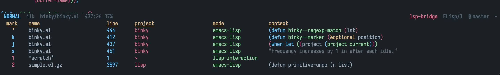
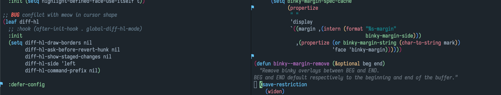
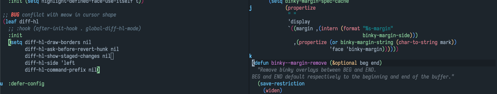

# binky

[](LICENSE)
[](http://melpa.org/#/binky)

Jump between points like a rabbit !

This package provides commands to jump between points in buffers and files.
Marked position, last jump position and recent buffers are all supported in
same mechanism like `point-to-register` but with an enhanced experience.

<!-- markdown-toc start -->

## Contents

- [binky](#binky)
  - [Screenshot](#screenshot)
  - [Install](#install)
    - [dependencies](#dependencies)
    - [package](#package)
  - [Usage](#usage)
  - [Customization](#customization)
  - [Feature](#feature)
  - [Comparison](#comparison)
  - [Todo](#todo)
  - [FAQ](#faq)
  - [License](#license)

<!-- markdown-toc end -->

## Screenshot

- Call `M-x binky-*` related command



`?` for toggle preview manually, `q` or `escape` for quit, `SPC` to toggle in groups

- Call `M-x binky-margin-mode`



- Or use mark as indicator, `(setq binky-margin-string nil)`



## Install

### dependencies

- Emacs, version >= 26.3

### package

- Manually

Clone and add to `load-path`, require the package.

- Melpa

This package is available on [MELPA].
Install with `M-x package-install` `RET` `binky` within Emacs.

## Usage

```elisp
;; Directly
(require 'binky)
(binky-mode)
;; margin highlight support
(require 'binky-margin)
(binky-margin-mode)

;; Or with `use-package`, etc
(use-package binky
  :hook (after-init-hook . (lambda () (binky-mode) (binky-margin-mode))))
```

- `binky-add` : add current position to records

- `binky-delete` : delete existed position from records

- `binky-jump` : jump to position of records

- `binky-jump-other-window` : jump to position of records in other widnow

- `binky-view` : view the position of records in other window without jumping

- `binky-recent-toggle` : toggle to enable or disable recent jump feature

- `binky-binky` : one command to rule all

  - press `j`, if record `j` exists, call `binky-jump`, otherwise call `binky-add`.
  - press `J`, call `binky-delete`.
  - press `alt-j`, call `binky-jump-other-window`.
  - press `ctrl-j`, call `binky-view`.

  With `C-u` prefix, keep editing until quit

- `binky-next-in-buffer` and `binky-previous-in-buffer`: jump between in current buffer

- `binky-margin-mode` : toggle to enable or disable margin indicator feature

- `binky-save` and `binky-restore`: save and restore manual records from file

## Customization

Lots of options are provided, see customization part in file.

## Feature

- Better UI experience than `register-to-point`, such as preview customization, jump highlight and margin indicator
- Integration with buffers switch, and more sorting strategies are provided now and in future
- Vim-like mark and jump style.

## Comparison

[Dogears](https://github.com/alphapapa/dogears.el)

- Bookmark style record
- More information: relevance, within, directory, etc

[Binky](https://github.com/liuyinz/binky.el)

- Register style record
- Vim-like mark and jump
- Flexible and customizable

I have used dogears for several months, and it's great in most features except lack of [Vim-marks](https://vim.fandom.com/wiki/Using_marks) style jumping feature 
which is top priority for me. While evil is too heavy, so I wrote this package to imitate parts of features.

Enjoy it.

## Todo

- [x] Avoid adding duplicated records
- [x] Margin indicator support
- [x] ~~More sorting strategy: frecency, duration~~
- [x] Add `SPC` to toggle preview records in groups
- [x] Show same buffer records first in groups view
- [x] Add command to store records cross sessions
- [ ] optimize preview color and style for easily lookup
- [ ] support for xref history
- [ ] Fringe indicator support

## FAQ

- `binky-margin` conflicts with other packages like [flycheck](https://github.com/flycheck/flycheck), [diff-hl](https://github.com/dgutov/diff-hl), linum-mode(built-in), etc ?

  `binky` supports only margin for now, so solutions here :

  - Use fringe in other packages

  ```elisp
  ;; flycheck
  ;; Use left-fringe or right-fringe
   (setq flycheck-indication-mode 'left-fringe)

  ;; diff-hl
  ;; use fringe by default, don't turn on diff-hl-margin-mode

  ;; linum-mode
  ;; don't support fringe, use display-line-numbers-mode (since 26.0.50) instead
  ```

  - Use different side of margin in other packages

  ```elisp
  (setq binky-indicator-side 'left)

  ;; flycheck, different margin side
  (setq flycheck-indication-mode 'right-margin)

  ;; diff-hl, different margin side
  (setq diff-hl-side 'right)
  (diff-hl-margin-mode)
  ```

- All records position change to 1 after run `format-all-buffer` command ?

  [format-all](https://github.com/lassik/emacs-format-all-the-code) formats buffer by overwriting it's entire content, all markers position would be change to position 1. Please use other formatters like [apheleia](https://github.com/radian-software/apheleia) instead.

## License

See [LICENSE](LICENSE).

[melpa]: http://melpa.org/#/binky
